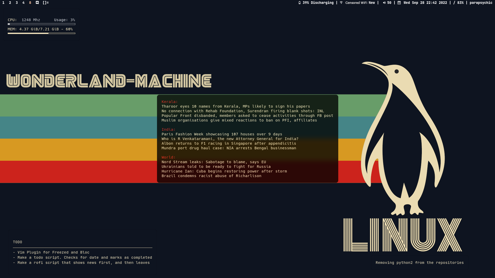
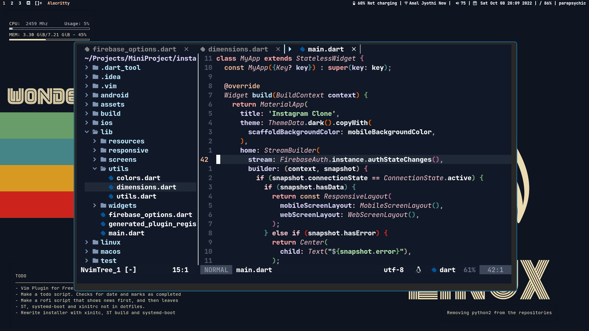
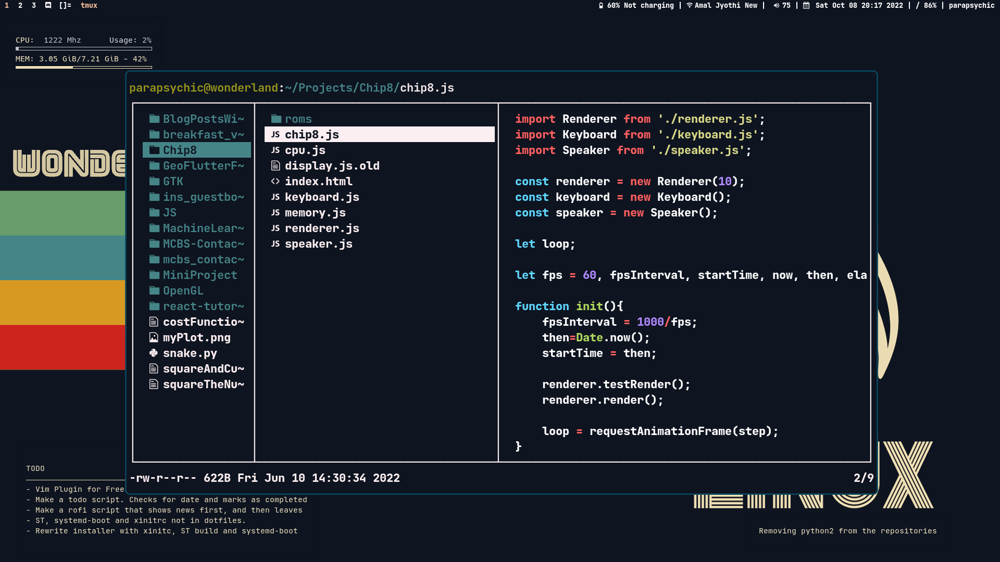

# Wonderland Machine Dots

<a href="https://www.reddit.com/r/unixporn/comments/xqit1s/dwm_kids_dont_read_news_these_days_they_said/"> 
  
</a>


Minimalistic retro themed rice. 








+ **Wallpaper**: [Tundra Gruvbox Linux](https://imgur.com/qTMjZoE) : Modified the gruvbox linux wallpaper to match Tundra colorscheme
+ **WM**: DWM
+ **Terminal**: ST
+ **Colorscheme**: Didn't really follow it through and through (as you can see), but I did use the [Tundra](https://github.com/sam4llis/nvim-tundra) colorscheme for Neovim by [u/Physical-Hat-8416](https://www.reddit.com/u/Physical-Hat-8416/) -> [Original post](https://www.reddit.com/r/neovim/comments/x9yws0/nvimtundra_a_punchy_dark_colorscheme_for_neovim/)
+ **File Manager**: lf with uberzug
+ RSS from news websites (Manorama, Indian Express, BBC World) and archlinux.org (bottom right)

Btw, if the colors look saturated to you, please understand that I own a cheap TUF with the least color accurate screen ever.

nvim.bak contains the nvim configs before I switched to Lua. It uses [coc](https://github.com/neoclide/coc.nvim). The new setup uses [nullls](https://github.com/jose-elias-alvarez/null-ls.nvim), [nvim-cmp](https://github.com/hrsh7th/nvim-cmp) and [nvim-lspconfig](https://github.com/neovim/nvim-lspconfig)

+ Rofi as emoji picker (launch using `Meta/Super + :`
+ No display manager, because startx is a thing
+ No GRUB, systemd-boot is enough.
+ I'll gradually move away from tmux as I patch ST. But not right now.


I use several dumb utility scripts. It's all in the .bin folder. i3, polybar configs are from previous setup. Not gonna delete those.

Don't look up my bashrc.


## Installation

Clone this repo and paste it in the config location. 

```bash
git clone https://github.com/parapsychic/dot-files/
#copying nvim
cp dot-files/nvim ~/.config/ #replace this with your config location, usually $XDG_HOME helps
```
Nvim requires additional steps. 


